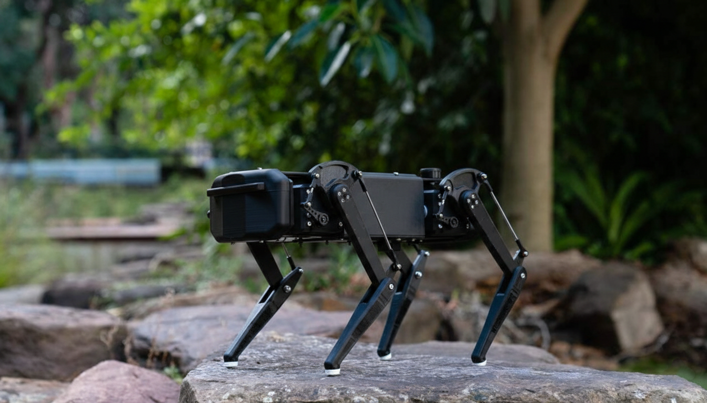

<h1 align="center">🐾 12-DOF Quadrupedal Robot</h1>

<b>Development of a 12-DOF Quadrupedal Robot with Enhanced Navigation</b>

------------------------------------------------------------------------

# 🤖 Project Overview

This project presents the **design and development of a
12‑Degree‑of‑Freedom (12‑DOF) quadrupedal robot** capable of navigating
uneven terrain.

Traditional wheeled robots struggle on **rocky surfaces, stairs, and
irregular ground**.\
Legged robots provide superior mobility by adapting their footholds and
posture.

Our robot uses:

-   🧠 **Raspberry Pi embedded control**
-   ⚙️ **High‑torque servo actuators**
-   🦾 **12 articulated joints**
-   🖥 **Inverse kinematics based motion control**
-   🎮 **Remote controller interface**

The goal is to create a **cost‑effective quadruped research platform**
suitable for robotics experimentation and education.

------------------------------------------------------------------------

# 🐕 Robot Preview

> This is a 3D design inspired and altered from the Open Source 3D model- DINGO THE ROBOT DOG.
> Credits Goes to the respective owners

------------------------------------------------------------------------

# ✨ Key Features

  Feature                         Description
  ------------------------------- -----------------------------------------
  🦾 12‑DOF Leg Design            3 joints per leg for natural locomotion
  🧠 Embedded Control             Raspberry Pi based architecture
  ⚙️ Torque‑Validated Actuation   Analytical actuator selection
  🎮 Remote Control               PS4 controller / keyboard input
  🧩 Modular Design               Easy upgrades for future research
  🌍 Terrain Adaptability         Handles uneven surfaces and slopes

------------------------------------------------------------------------

# 🧠 System Architecture

    User Input (PS4 Controller / Keyboard)
                │
                ▼
          Raspberry Pi Controller
                │
          Gait Controller
                │
          Inverse Kinematics
                │
          Hardware Interface
                │
            Servo Driver
                │
            Servo Motors

------------------------------------------------------------------------

# ⚙️ Robot Specifications

  Parameter            Value
  -------------------- ------------------
  Degrees of Freedom   12 DOF
  Leg Configuration    3 joints per leg
  Body Length          380 mm
  Body Width           250 mm
  Shoulder Height      250 mm
  Thigh Length         140 mm
  Shank Length         140 mm
  Robot Mass           \~3 kg
  Payload Capacity     \~0.5 kg

------------------------------------------------------------------------

# 🔧 Hardware Components

## Embedded Controller

-   Raspberry Pi

## Actuators

-   STS3215 Serial Servo
-   35kg PWM Servo

## Mechanical Structure

-   3D printed polycarbonate components

## Communication

-   I2C servo communication
-   PWM servo control

------------------------------------------------------------------------

# 🧮 Torque Validation

Joint torque was analytically calculated to ensure proper actuator
selection.

Example:

τ = m × g × L

For the knee joint:

τ ≈ 2.06 Nm

Selected actuators provide **higher torque than required**, ensuring
stable operation.

------------------------------------------------------------------------

# 🧪 Testing

The robot was tested through several stages:

### Static Testing

-   Posture validation
-   Load‑bearing verification
-   Joint limit testing

### Dynamic Testing

-   Forward walking
-   Turning
-   Incline traversal

### Monitoring

-   Servo temperature
-   Power consumption

The robot successfully demonstrated **stable walking and controlled
locomotion**.

------------------------------------------------------------------------

# 🌍 Applications

Quadrupedal robots can be used in:

-   🚨 Disaster inspection
-   🧭 Rough terrain exploration
-   🌾 Agricultural monitoring
-   🏭 Industrial inspection
-   🔍 Search and rescue missions

------------------------------------------------------------------------

# 🔮 Future Work

Future improvements may include:

-   Computer vision navigation
-   SLAM based localization
-   IMU stabilization
-   Autonomous path planning
-   Advanced gait optimization

------------------------------------------------------------------------

# 📂 Repository Structure

    quadruped-robot
    │
    ├── CAD
    │   ├── body_design
    │   └── leg_components
    │
    ├── firmware
    │   └── servo_control
    │
    ├── control
    │   ├── gait_controller
    │   └── inverse_kinematics
    │
    ├── simulation
    │   └── gazebo
    │
    ├── electronics
    │   └── wiring_diagrams
    │
    ├── images
    │   ├── robot.jpg
    │   └── demo.gif
    │
    └── README.md

------------------------------------------------------------------------

# 🎓 Academic Information

**BSc Engineering (Hons)**\
Department of Electrical and Telecommunication Engineering\
South Eastern University of Sri Lanka

### Authors

Balakumar Premamyuresan\
Sahayanathan Renolson\
Jeyapalasingam Jeluxshan

### Supervisors

Dr. W.G.C.W Kumara\
Dr. Ajmal Hinas\
Eng. S. Sampavi

------------------------------------------------------------------------

# ⭐ Contribution

This project demonstrates that **locally engineered quadrupedal robots** can be developed using accessible hardware, supporting robotics research and education.

---

# 📜 License

Academic research project.

---

⭐ If you like this project, consider giving it a star!

